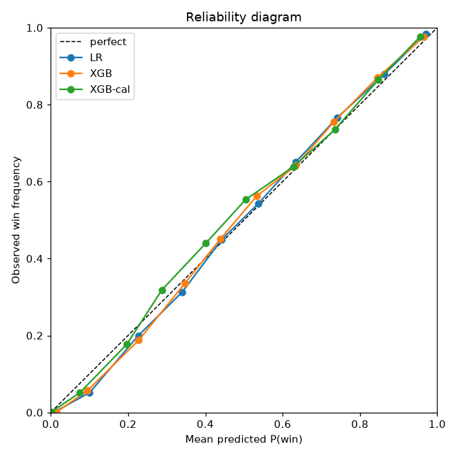
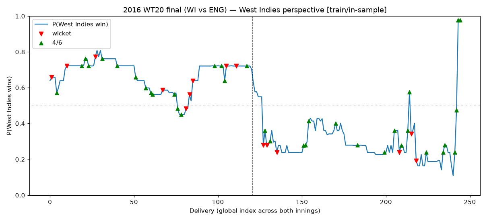

# T20 Win Probability Model

**Built a ball-by-ball T20 win-probability model on 1M+ deliveries, rigorously benchmarked on log loss (0.436), Brier score (0.145), and calibration error (ECE ≈ 0.02) under a strict time-based split — then turned the calibrated probabilities into a "Win Probability Added" clutch metric that ranks the batters and bowlers who most swing matches, shipped as a live Streamlit app.**

**🏏 Live app: [t20winprobabilitymodel.streamlit.app](https://t20winprobabilitymodel.streamlit.app/)** — the interactive implementation of this project.

Ball-by-ball win probability for T20 cricket. The model predicts **P(the
current batting team wins)** after every legal and illegal delivery of a match,
trained on public [Cricsheet](https://cricsheet.org/) data (IPL + men's T20
internationals, **~4,469 model matches**). On top of the per-ball probabilities
it derives **Win Probability Added (WPA)** — a "clutch" metric that credits each
delivery's swing in win probability to the striker (`+ΔWP`) and the bowler
(`−ΔWP`), producing player leaderboards of who most moved the needle.

## What it does

- **Win probability**: score any ball state → calibrated P(batting team wins).
- **WPA / clutch**: aggregate per-ball ΔWP into batter and bowler leaderboards,
  overall and IPL-only, per season and all-time.
- **Trajectories**: plot the win-probability arc of a whole match (e.g. the 2016
  World T20 final) with wicket and boundary markers.

All three models (logistic-regression baseline, XGBoost, isotonic-calibrated
XGBoost) are trained and evaluated by a single reproducible harness with hard
gate checks; the **calibrated XGBoost is the production model** used for WPA.

## Dataset

Ball-by-ball JSON from Cricsheet:

- `ipl_json.zip` — all IPL matches (2008–)
- `t20s_male_json.zip` — all men's T20 internationals (2005–)

Phase 1 parses **4,707** matches / **1,076,776** ball rows. Matches that are
**DLS-affected, no-result, non-standard (not 20 overs), or super-over-only** are
flagged and excluded from modelling, leaving **4,469 model matches** (3,258
T20I + 1,211 IPL). See [`reports/phase1_gate.md`](reports/phase1_gate.md).

Place both zips in `data/raw/` and extract to `data/raw/ipl/` and
`data/raw/t20s/` before running the pipeline (data is gitignored and fully
reproducible from Cricsheet).

## Methodology

### Leakage control

Everything that could leak the future is computed **only from strictly-earlier
matches** or fit **only on the training split**:

- **Historical / venue / team features** (`venue_par`, `batting_strength`,
  `bowling_strength`, `strength_diff`) use rolling windows over matches that
  finished *before* the match being predicted — never the current or future
  matches. Phase 2 asserts this with explicit **`venue_par` leakage-safe
  checks**: for eight sampled matches the stored par equals the par
  recomputed from only prior matches (all ✅ in
  [`reports/phase2_gate.md`](reports/phase2_gate.md)).
- **The logistic-regression pipeline** (`SimpleImputer` → `StandardScaler` →
  `LogisticRegression`) is `fit` on the **train split only**; the imputer
  medians and scaler statistics never see val/test.
- Isotonic **calibration is fit on the validation split**, not test.

### Frozen, time-based, match-level split

Rows are split **by match and by time**, never randomly by row — every delivery
in a match shares the same outcome label, so a random row split would leak the
result across train/test. The split is frozen in `data/processed/splits.json`:

| split | matches | through date |
|:------|--------:|:-------------|
| train | 3,355   | 2024-10-22 |
| val   | 445     | 2025-07-21 |
| test  | 669     | 2026-07-13 |

Train on older seasons, validate on the next window, test on the most recent —
a realistic "predict the future" protocol.

### Ties, DLS, super overs

DLS / no-result / non-20-over / super-over matches are excluded up front (Phase
1). **Tied matches** (`won == 0.5`) are kept for descriptive WP trajectories but
**dropped when fitting the binary models**, so labels are clean 0/1. Non-tie
rows used for model fit: **train 773,897 / val 101,116 / test 152,677** (see
[`reports/phase3_gate.md`](reports/phase3_gate.md)).

### Models

| model | what |
|:------|:-----|
| **LR** | median-impute + standardize + logistic regression (strong linear baseline) |
| **XGBoost** | two-stage manual search (structure, then regularization) with early stopping on val; best params `max_depth=4, learning_rate=0.1, best_iteration=89`; predicts through NaN natively |
| **XGB-cal** | isotonic calibration of the fitted XGB via `CalibratedClassifierCV(FrozenEstimator(xgb), method="isotonic")` fit on val (the sklearn-1.9 replacement for the removed `cv="prefit"`) — **the production model** |

**Test metrics (overall, non-tie — 662 matches, 152,677 rows):**

| model   | log loss | Brier |
|:--------|---------:|------:|
| LR      | 0.4356   | 0.1447 |
| XGB     | 0.4409   | 0.1467 |
| XGB-cal | 0.4398   | 0.1469 |

**IPL-only test (71 matches, 17,008 rows):**

| model   | log loss | Brier |
|:--------|---------:|------:|
| LR      | 0.5320   | 0.1813 |
| XGB     | 0.5557   | 0.1935 |
| XGB-cal | 0.5618   | 0.1961 |

**Honest finding — XGBoost does not beat the linear baseline.** After a genuine
two-stage regularization search, a well-regularized XGBoost still does **not**
beat logistic regression on test log loss. This is a real result, not a tuning
gap: the engineered rate/par features (current/required run rate,
`rrr_minus_crr`, projected/target-vs-par, `strength_diff`) are already
**near-linear in the win log-odds**, so the linear model is a strong baseline
here. We report it plainly as evidence of an honest evaluation harness. The
calibrated XGBoost is still retained as the production model for WPA — it gives
smooth per-ball probabilities and handles missing chase features natively —
with the "XGB < LR" soft-check WARN kept intentionally in the gate report.

### Calibration evidence

Reliability diagram on the held-out test set (all three models):



Expected / maximum calibration error (overall test): **LR** ECE 0.0196 / MCE
0.0491, **XGB** 0.0210 / 0.0398, **XGB-cal** 0.0211 / 0.0488 — all three are
already well calibrated, which is *why* isotonic calibration barely moves the
XGB curve.

### Win Probability Added (WPA)

The calibrated model scores **every ball** to get `wp` = P(batting team wins).
Per-ball **ΔWP** is the change in the current batting team's win probability,
computed **per innings** on the correct perspective (innings-1 prior = 0.5;
innings-2 prior = `1 − last_wp_inn1`, i.e. the chasing team's view of the
first-innings finish). Each ball's swing is credited `batter_credit = +ΔWP` to
the striker and `bowler_credit = −ΔWP` to the bowler, so summing bowler credit
rewards bowlers who most *reduced* the batting team's win probability. This
telescopes exactly per innings and balances per ball (both are hard gates in
[`reports/phase4_gate.md`](reports/phase4_gate.md)). Leaderboards require a
minimum of **300 balls** per player/season to filter tiny samples.

**Top-10 IPL clutch batters, all seasons** (`reports/wpa/ipl_batter_clutch_allseasons.csv`):

| batter | clutch | balls |
|:-------|-------:|------:|
| AB de Villiers | 10.061 | 3411 |
| CH Gayle       |  7.353 | 3367 |
| V Sehwag       |  6.841 | 1787 |
| JC Buttler     |  6.414 | 3131 |
| KA Pollard     |  6.067 | 2433 |
| AD Russell     |  5.773 | 1586 |
| DA Warner      |  5.647 | 4697 |
| SK Raina       |  5.403 | 4102 |
| V Kohli        |  5.296 | 7022 |
| RR Pant        |  5.237 | 2658 |

**Top IPL clutch bowlers, all seasons** (`reports/wpa/ipl_bowler_clutch_allseasons.csv`):
SP Narine, B Kumar, JJ Bumrah, Rashid Khan, SL Malinga, R Ashwin.

### Showcase — 2016 World T20 final

West Indies' chase of 156 against England, on a fixed West Indies perspective
(red = wickets, green = fours/sixes, dashed line = innings break). Carlos
Brathwaite's four sixes in the final over send the win probability from near
zero to a near-certain win:



## Reproduction

```bash
pip install -r requirements.txt

# 1. parse Cricsheet JSON -> matches/balls tables + Phase 1 gate
python scripts/run_ingest.py
# 2. engineer leakage-safe features + frozen time split + Phase 2 gate
python scripts/run_features.py
# 3. train LR / XGB / calibrated-XGB, evaluate, plot, Phase 3 gate
python scripts/run_eval.py
# 4. per-ball WPA + clutch leaderboards + Phase 4 gate
python scripts/run_wpa.py
```

Then open the walkthrough notebook (loads the calibrated model + artifacts,
reusing `t20wp` functions — no re-implemented logic; needs the dev deps:
`pip install -r requirements-dev.txt`):

```bash
jupyter nbconvert --to notebook --execute --inplace \
  --ExecutePreprocessor.kernel_name=python3 notebooks/showcase.ipynb
# or interactively: jupyter lab notebooks/showcase.ipynb
```

Per-phase gate reports (metrics, checks, figures) live in
[`reports/`](reports/): [phase 1](reports/phase1_gate.md) ·
[phase 2](reports/phase2_gate.md) · [phase 3](reports/phase3_gate.md) ·
[phase 4](reports/phase4_gate.md).

## Repo structure

```
src/t20wp/        package code
  ingest.py       Cricsheet JSON -> matches.parquet + balls.parquet
  features.py     leakage-safe features, feature/id/label column sets
  models.py       split loading, LR / XGB / isotonic-calibration, persistence
  evaluate.py     metrics, calibration tables/plots, WP-trajectory plotter
  wpa.py          per-ball ΔWP credit assignment + clutch leaderboards
scripts/          one runnable entry point per phase (run_ingest ... run_wpa)
notebooks/        showcase.ipynb (thin — reuses src/t20wp)
reports/          gate reports, figures/, wpa/ leaderboards
data/             raw + processed data (gitignored, reproducible)
models/           trained models + prediction artifacts (gitignored)
tests/            pytest unit tests for evaluate + wpa
```

## Requirements & tests

Python 3.12; runtime deps in [`requirements.txt`](requirements.txt) (pandas,
numpy, scikit-learn ≥ 1.9, xgboost ≥ 3.3, matplotlib, joblib, streamlit).
Test/notebook deps (pytest, jupyter, nbconvert, ipykernel) are in
[`requirements-dev.txt`](requirements-dev.txt). Run the unit tests with:

```bash
pip install -r requirements-dev.txt
pytest
```
