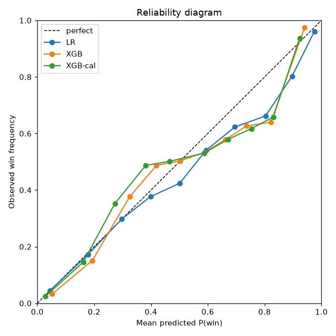
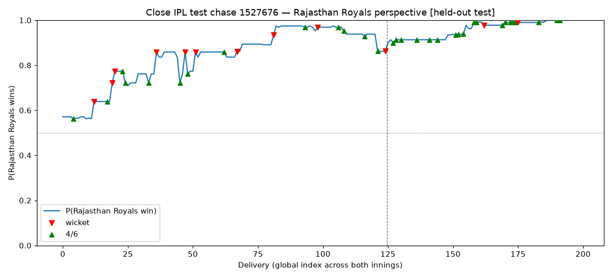
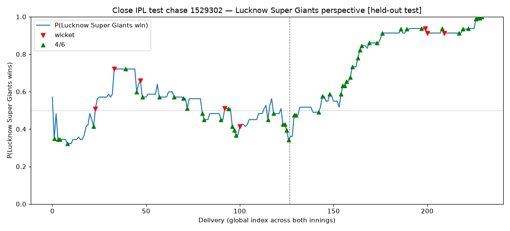
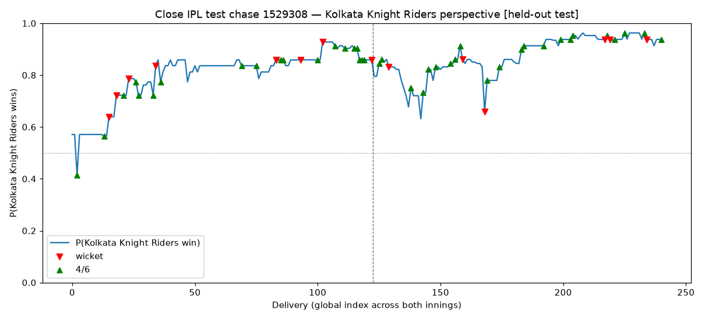

# Phase 3 gate report

## Split / tie summary

|       |   rows (non-tie) |   tie rows dropped |
|:------|-----------------:|-------------------:|
| train |           773897 |              10305 |
| val   |           101116 |                745 |
| test  |           152677 |               1759 |

## Test metrics — overall (662 matches, 152,677 rows)

| model   |   log_loss |   brier |      n |   base_rate |    ece |    mce |
|:--------|-----------:|--------:|-------:|------------:|-------:|-------:|
| LR      |     0.4356 |  0.1447 | 152677 |      0.4838 | 0.0196 | 0.0491 |
| XGB     |     0.4409 |  0.1467 | 152677 |      0.4838 | 0.021  | 0.0398 |
| XGB-cal |     0.4398 |  0.1469 | 152677 |      0.4838 | 0.0211 | 0.0488 |

## Test metrics — IPL only (71 matches, 17,008 rows)

| model   |   log_loss |   brier |     n |   base_rate |
|:--------|-----------:|--------:|------:|------------:|
| LR      |     0.532  |  0.1813 | 17008 |      0.4905 |
| XGB     |     0.5557 |  0.1935 | 17008 |      0.4905 |
| XGB-cal |     0.5618 |  0.1961 | 17008 |      0.4905 |

## Calibration (ECE / MCE, overall test)

|         |    ece |    mce |
|:--------|-------:|-------:|
| LR      | 0.0196 | 0.0491 |
| XGB     | 0.021  | 0.0398 |
| XGB-cal | 0.0211 | 0.0488 |

## XGBoost tuning trials (best params: {'max_depth': 4, 'learning_rate': 0.1, 'min_child_weight': 1, 'subsample': 1.0, 'colsample_bytree': 1.0, 'reg_lambda': 1.0})

| stage                 |   max_depth |   learning_rate |   min_child_weight |   subsample |   colsample_bytree |   reg_lambda |   best_iteration |   val_log_loss |
|:----------------------|------------:|----------------:|-------------------:|------------:|-------------------:|-------------:|-----------------:|---------------:|
| stage1_structure      |           4 |            0.1  |                  1 |         1   |                1   |            1 |               89 |         0.4682 |
| stage2_regularization |           4 |            0.1  |                  1 |         1   |                1   |            1 |               89 |         0.4682 |
| stage2_regularization |           4 |            0.1  |                  1 |         0.8 |                1   |            5 |               84 |         0.4694 |
| stage1_structure      |           4 |            0.03 |                  1 |         1   |                1   |            1 |              296 |         0.4696 |
| stage1_structure      |           4 |            0.03 |                  5 |         1   |                1   |            1 |              314 |         0.47   |
| stage1_structure      |           4 |            0.1  |                  5 |         1   |                1   |            1 |               89 |         0.4701 |
| stage2_regularization |           4 |            0.1  |                  1 |         0.8 |                1   |            1 |               97 |         0.4701 |
| stage2_regularization |           4 |            0.1  |                  1 |         1   |                1   |            5 |               91 |         0.4701 |
| stage2_regularization |           4 |            0.1  |                  1 |         0.8 |                0.8 |            5 |              114 |         0.4709 |
| stage2_regularization |           4 |            0.1  |                  1 |         1   |                0.8 |            1 |               98 |         0.4714 |
| stage2_regularization |           4 |            0.1  |                  1 |         1   |                0.8 |            5 |              100 |         0.4715 |
| stage1_structure      |           6 |            0.03 |                  1 |         1   |                1   |            1 |              171 |         0.4725 |
| stage2_regularization |           4 |            0.1  |                  1 |         0.8 |                0.8 |            1 |              104 |         0.4726 |
| stage1_structure      |           6 |            0.03 |                  5 |         1   |                1   |            1 |              165 |         0.4733 |
| stage1_structure      |           6 |            0.1  |                  1 |         1   |                1   |            1 |               44 |         0.4742 |
| stage1_structure      |           6 |            0.1  |                  5 |         1   |                1   |            1 |               46 |         0.475  |

## Figures

- 
- 
- 
- 
- 
- 

## Checks (hard gates)

- PASS p_lr all finite 
- PASS p_lr all in [0, 1] 
- PASS p_xgb all finite 
- PASS p_xgb all in [0, 1] 
- PASS p_cal all finite 
- PASS p_cal all in [0, 1] 
- PASS 951373 WI WP drops on a WI wicket (DJ Willey over) (ball_seq 15: 0.302 -> 0.238)
- PASS 951373 WI WP rises across final-over sixes (0.109 -> 0.978)
- PASS artifact written: lr.joblib 
- PASS artifact written: xgb.joblib 
- PASS artifact written: xgb_calibrated.joblib 
- PASS artifact written: test_predictions.parquet 
- PASS artifact written: calibration_overall.png 
- PASS artifact written: calibration_ipl.png 
- PASS artifact written: wp_trajectory_951373.png 
- PASS artifact written: wp_trajectory_1527676.png 
- PASS artifact written: wp_trajectory_1529302.png 
- PASS artifact written: wp_trajectory_1529308.png 

## Soft checks (reported, non-blocking)

- WARN: XGB test log loss < LR (XGB 0.4409 vs LR 0.4356)
- WARN: calibrated ECE <= uncalibrated XGB ECE (cal 0.0211 vs xgb 0.0210)

> **Note on XGB vs LR:** after a genuine two-stage regularization search (structure: max_depth x learning_rate x min_child_weight; then subsample x colsample_bytree x reg_lambda), XGBoost still does not beat the logistic-regression baseline on test log loss. This is a legitimate finding, not a tuning gap: the engineered rate/par features (current/required run rate, rrr_minus_crr, projected/target vs par, strength_diff) are already near-linear in the win log-odds, so a well-regularized linear model is a strong baseline here. The calibrated XGB is retained as the production model for Phase 4 WPA (smooth per-ball probabilities, native NaN handling); the soft-check WARN is kept intentionally.
